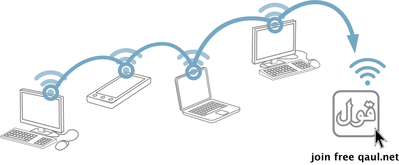

qaul.net
========

**qaul.net** is an ad-hoc wireless mesh-network suite that harnesses the 
power of everyday devices such as computers and smartphones to create a 
**Democratic**, **Non-Centralized**, **Mesh Network** on which users can 
share files, have voice chats and send each other messages, however the 
power of qaul.net allows an endless feature set as anyone can run any 
LAN-based application over the network. qaul.net removes the dependence 
on the centralized services such as the Internet and cellular networks 
and creates a network that anyone can be part of and share freely with 
no censorship what so ever.

qaul.net has the following features:

* File sharing (both private and public)
* Voice calling
* Text messaging (both private and public)
* Sharing your Internet connection (via a given interface) to the whole mesh
* Custom network settings (to setup your own **personal** mesh)
* Viewing of the whole mesh as a diagram
* Ability to run `olsr` (the mesh routing procotol) on any interface (wifi, ethernet)
* And because this is a mesh-**network** you can run any service you want on your node and it will be available on the network (Web server, Mail server, SSH server, FTP server etc.)

Build Instructions
------------------

There are specific instructions for each system qaul.net has been 
tested on in the [documentation folder](doc). Feel free to add new ports!

* Android 
  * Build Android [doc/Android.md](doc/Android.md)
  * Supported Devices [doc/Android_Devices.md](doc/Android_Devices.md)
* Linux
  * Debian, Ubuntu, Mint [doc/Linux_Debian.md](doc/Linux_Debian.md)
  * All other Linux distributions [doc/Linux.md](doc/Linux.md)
* OSX [doc/OSX.md](doc/OSX.md)
* Windows [doc/Windows.md](doc/Windows.md)
* Raspberry Pi
  * Raspbian [doc/Raspberry_Raspbian.md](doc/Raspberry_Raspbian.md)
  * Ubuntu Mate [doc/Raspberry_UbuntuMate.md](doc/Raspberry_UbuntuMate.md)

Binary Downloads
----------------

* [Latest stable](https://qaul.net/download) - Latest stable builds
* [Nightly builds](https://qaul.net/binaries/nightly/) - Built whenever commits to `qaul-ng` are made
* [Old versions](https://qaul.net/binaries/) - Older versions of the qaul.net software

Documentation
-------------

* [Documentation folder](doc/)
* [Software architecture](https://github.com/qaul/qaul.net/wiki/SoftwareArchitecture)
* [HTML5 GUI development](doc/GUI.md)
* [Add a configuration template for your wifi mesh community](GUI/www/community-templates/)

License
-------

qaul.net is free open source software licensed under the 
[GNU General Public License version 3](Licenses/GPLv3.txt).

To see all external code's licenses used in this project please 
visit the [License directory](Licenses).
