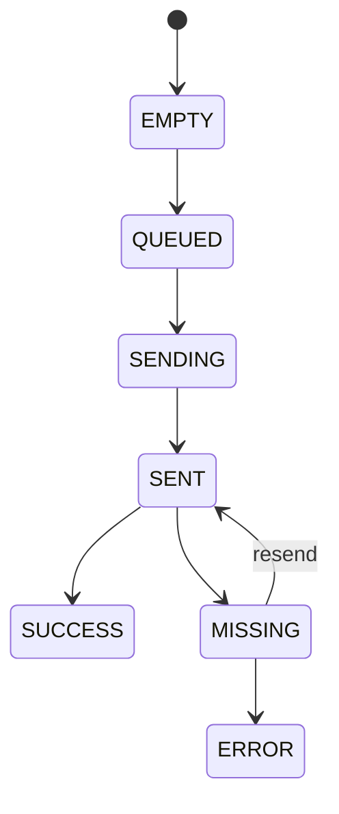
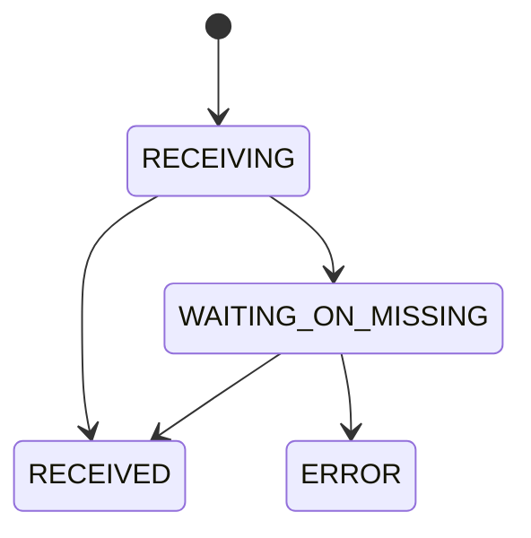
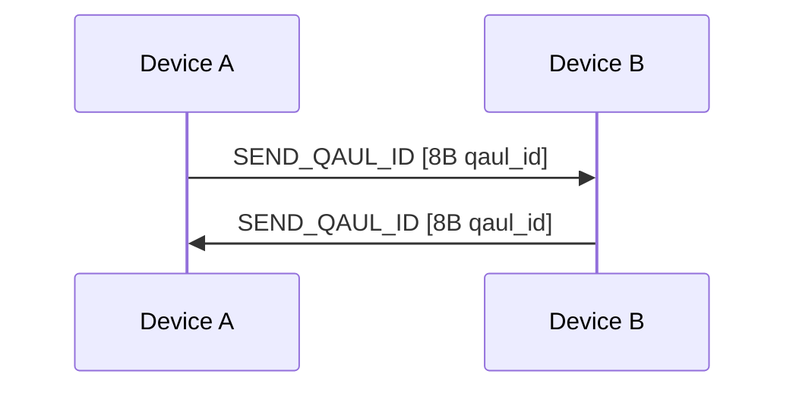
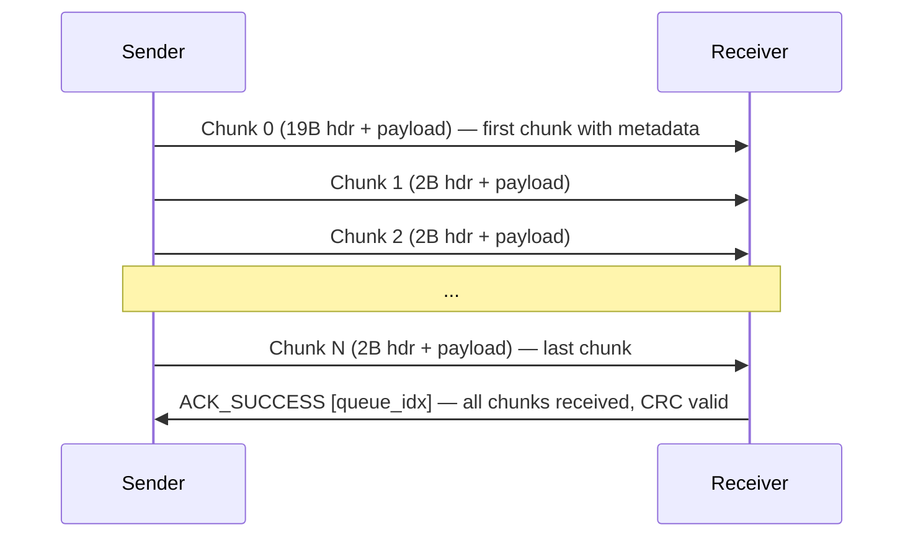
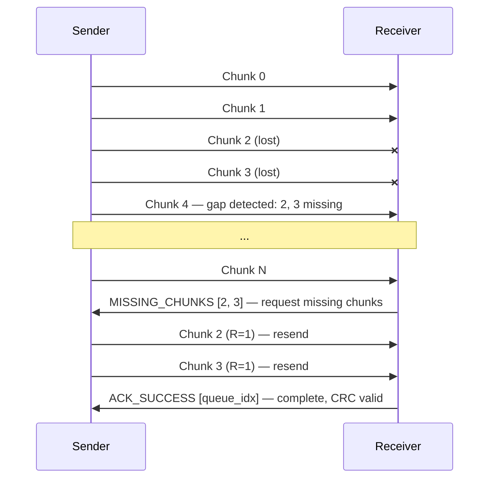
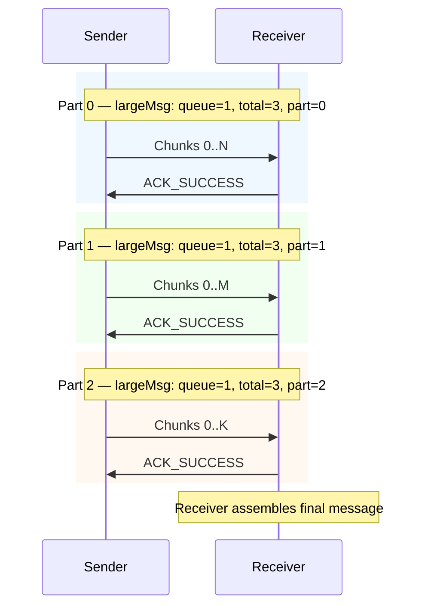

# BLE GATT Messaging Diagrams

## Chunk Header (2 Bytes)

Every chunk begins with a 2-byte header (FLC messages are interpreted differently):

## Large Message Indicator Byte

Messages larger than **18,342 bytes** are split into up to 4 parts. Each part is sent as a separate chunked message with this indicator byte set in its first chunk header:

## SendQueueMessage States

## ReceiveQueueMessage States

## Complete Message Flow

### 1. Identity Handshake

On every new connection, both sides exchange qaul IDs:

### 2. Normal Message Transmission

### 3. Missing Chunk Recovery

### 4. Large Message Transmission

Messages larger than 18,342 bytes are split into up to 4 parts:

Each part is independently chunked and ACK'd. Once all parts are received, the receiver concatenates them into the final message.
