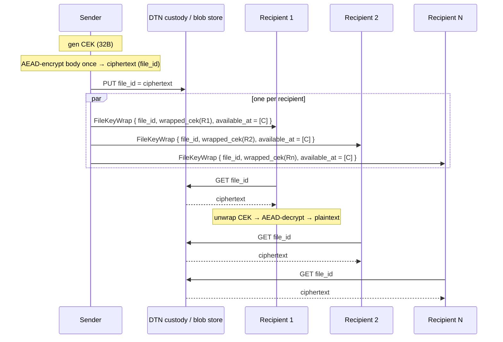

# Reducing per-recipient file encryption cost in groups

## Situation

qaul currently encrypts each chat / file message **once per recipient**, under
the sender's pairwise Noise KK session with that recipient. For a chat group
of `N` members the sender therefore:

1. Performs `N − 1` AEAD encryptions of the same plaintext.
2. Emits `N − 1` ciphertexts onto the wire.
3. (Indirectly) asks the routing / DTN layer to carry `N − 1` independent
   copies of the same payload to potentially overlapping next hops.

For short text messages this is acceptable. For **file messages** — where a
single payload can be megabytes — the cost scales badly: a 10 MB attachment
in a 100-person group costs ~1 GB of ciphertext to produce, store and ship.

Concrete call sites in the current code base:

- `services::chat::file::send_filecontainer_to_group`
  (`rust/libqaul/src/services/chat/file.rs:849`) builds one
  `messaging::proto::FileMessage { content: data }` and hands it to
  `Group::send_to_remote_members`.
- `Group::send_to_remote_members`
  (`rust/libqaul/src/services/group/mod.rs:158`) loops over every group
  member and calls `Messaging::pack_and_send_message(... data.to_vec() ...)`
  for each. `pack_and_send_message` in turn runs `Crypto::encrypt` with that
  recipient's pairwise Noise session, producing one fresh AEAD ciphertext
  per member.

The plaintext (`data`) is identical across recipients, but every recipient
pays its own full-file encryption cost.

## Goal

Make the encryption + bandwidth cost of a single in-group file message
approach **O(file_size) + O(N · constant)** instead of **O(N · file_size)**,
without:

- introducing a long-lived group key (we want forward secrecy of files at
  rest to remain bounded by Noise's per-pair guarantees),
- assuming members are online simultaneously (qaul is delay-tolerant; DTN
  custody can hold messages for days or weeks),
- breaking peers that don't speak the new wire format (capability-gated
  rollout, like `Capabilities::ROTATION`).

## Proposed approach: per-file Content Encryption Key (CEK) + per-recipient key wrap

This is classic **envelope encryption** (a.k.a. hybrid encryption), adapted
to qaul's existing per-peer Noise sessions.

### Outline

For each outgoing file message the sender:

1. Generates a fresh random **CEK** (32 bytes; ChaCha20-Poly1305 key).
2. AEAD-encrypts the file body **once** under the CEK, producing a single
   `ciphertext` blob of size ≈ `plaintext_length + 16`.
3. For each remote group member `r`:
   - looks up the active Noise session with `r`,
   - AEAD-encrypts (`wraps`) the CEK under that session's outbound transport
     key, producing a ~ 48-byte `wrapped_cek`,
   - emits a small `FileKeyWrap` message to `r` over the existing messaging
     transport (signed and Noise-encrypted as usual).
4. Publishes the file ciphertext once via the DTN custody / blob path,
   keyed by a content-addressable `file_id`. Each recipient fetches the
   body using `file_id` and decrypts it with the wrapped CEK.

The crypto load on the sender becomes:

- 1 × full-file AEAD encryption,
- N × (≤ 80-byte) AEAD encryption for the key wraps.

The bandwidth load drops similarly: instead of `N × file_size`, the sender
needs to push the body to the custody layer **once** and then ship
`N × O(100 bytes)` key-wrap envelopes.

### Sequence



The `FileKeyWrap` rides the existing Noise-encrypted messaging path, so
authenticity and confidentiality of the wrap are identical to today's
direct messages — no new pairwise crypto primitive is needed.

## Wire format (sketch)

```proto
// Encrypted file body, content-addressable by file_id.
// Lives in the DTN custody store / sled blob tree; never sent inline
// on the Noise sessions.
message FileEnvelope {
    // 32-byte BLAKE3 hash of (sender_id || created_at || nonce ||
    // plaintext_length); also the addressing key in the blob store.
    bytes file_id = 1;
    bytes sender_id = 2;
    uint64 created_at = 3;
    string mime_type = 4;
    uint64 plaintext_length = 5;
    // 12-byte ChaCha20-Poly1305 nonce.
    bytes ciphertext_nonce = 6;
    // AEAD ciphertext of the file body. The CEK is NEVER stored here.
    bytes ciphertext = 7;
}

// Per-recipient envelope, sent over the existing pairwise Noise session.
// Small (~150 bytes); the bandwidth saving comes from NOT including the
// body in this message.
message FileKeyWrap {
    bytes file_id = 1;
    // CEK encrypted under the sender→recipient Noise transport key.
    // Nonce is the regular session outbound counter (reused from the
    // surrounding messaging frame; no new nonce space).
    bytes wrapped_cek = 2;
    // Hints where the recipient can pull the body. Each entry is a
    // PeerId of a node believed to be holding `file_id`. Empty list
    // means "ask the sender". DTN custody nodes are populated here
    // when custody routing is active.
    repeated bytes available_at = 3;
}
```

The `FileKeyWrap` slots into `messaging::proto::common_message::Payload` as a
new variant (next free field number), gated on the new
`Capabilities::ENVELOPE_FILE` bit. Peers without the bit continue to receive
the legacy `FileMessage { content: ... }` form — see *Rollout* below.

## Storage

The body lives in a new sled tree on each node:

```
file_blobs/{file_id} → bincode(FileEnvelope)
```

- **Sender** writes once on send, keeps it until eviction policy fires
  (size budget; not yet specified — out of scope here).
- **DTN custody node** writes on first PUT and serves GET requests; same
  TTL rules as a custody-routed direct message.
- **Recipient** writes on successful GET (so it can re-share later) and
  evicts according to local policy.

`file_id` is content-addressable, so the same body shipped twice by the
same sender deduplicates naturally.

## Threat model deltas vs. today

| Property | Today | Proposed |
| --- | --- | --- |
| Plaintext confidentiality at rest on sender | already plaintext locally | unchanged |
| Plaintext confidentiality at rest on recipient | encrypted under that recipient's session | encrypted under CEK; CEK in `wrapped_cek` |
| One compromised member leaks file | yes (that recipient's plaintext) | yes (CEK + that recipient's wrap) — **no worse** |
| Member removed from group can still read past files | yes | yes (they hold the CEK) — **same** |
| Member added later can read past files | no (no session with sender at send time) | no (no `wrapped_cek` emitted for them) — **same** |
| Forward secrecy of the body across Noise rotation | n/a (re-encrypted per recipient) | CEK survives rotation; bound to file lifetime only |
| Body integrity | per-pair AEAD tag | single AEAD tag on body + per-pair AEAD tag on wrap |

Notable: the CEK is **per file**, not per group. This means:

- A removed group member retains the ability to decrypt files **they were
  already given the wrap for**, but cannot decrypt future files (the sender
  simply omits them from the next `FileKeyWrap` fan-out). This matches the
  current behaviour, which has the same property.
- There is no group-level forward secrecy ratchet. Adding one (MLS,
  sender keys) is **explicitly out of scope** for this proposal — it is a
  much larger protocol commitment and conflicts with DTN's offline
  tolerance assumptions. This proposal is intended as a low-risk
  bandwidth/CPU optimisation, not a re-architecture of the group crypto.

## Rollout

A new capability bit:

```rust
impl Capabilities {
    /// Speaks the FileEnvelope + FileKeyWrap two-message form for
    /// group file delivery. Absence means the peer expects the
    /// legacy `FileMessage { content }` inline form.
    pub const ENVELOPE_FILE: u32 = 1 << 2; // ROTATION = 1<<0, ROTATION_RECEIPT_BOUND = 1<<1
}
```

On send, the sender groups members by capability:

- For members with `ENVELOPE_FILE`: write the body once to the blob store,
  emit one `FileKeyWrap` per such member.
- For members without `ENVELOPE_FILE`: fall back to today's path — one
  inline AEAD-encrypted `FileMessage` per such member.

Mixed groups therefore pay the inline cost only for the legacy members,
which lets us ship the optimisation without flag-day coordination. As the
capability bit becomes universal the legacy path can be removed.

## Implementation phases

1. **Phase 1 — primitives, no protocol change.** Add CEK generation,
   `FileEnvelope` / `FileKeyWrap` encode/decode, blob-store sled tree,
   unit tests for round-trip and wrap-under-rotation. No call-sites
   touched.
2. **Phase 2 — capability bit + send path.** Allocate
   `Capabilities::ENVELOPE_FILE`, advertise it locally
   (`Capabilities::LOCAL |= ENVELOPE_FILE`), refactor
   `send_filecontainer_to_group` to take the envelope path for
   capable members. Keep legacy path for non-capable members.
3. **Phase 3 — receive path + blob fetch.** Wire `FileKeyWrap` handling in
   `services::messaging::process`; implement the GET-by-file_id RPC from
   recipient → `available_at` peer. Integration test: 1 sender + 3 receivers,
   one of which is offline at send time and comes online after.
4. **Phase 4 — DTN custody integration.** Teach the DTN custody router to
   accept `FileEnvelope` blobs as custody payloads (existing custody PR
   plumbing). Recipients prefer custody nodes in `available_at`.
5. **Phase 5 — eviction policy.** Local cache size budget; receipts that
   stop senders from holding bodies once every wrap has been confirmed
   delivered (ties in nicely with the receiver-confirmation grace work on
   the rotation side — same primitive).

## Out of scope (deliberately)

- Group key agreement / MLS / sender keys. The cost-benefit doesn't make
  sense for qaul's DTN model in a first step; this proposal explicitly
  preserves pairwise crypto.
- Post-compromise security for files (recovering after a CEK leak). The
  CEK is per file; the only mitigation today would be re-encrypting the
  body, which is exactly the cost we're trying to avoid. Treated as
  acceptable for this iteration.
- Body deduplication across senders (same file shipped by two different
  members). Content addressing in principle allows it, but it leaks
  "two members have access to the same plaintext" to any node holding the
  blob. Default off; flag for later study.
- Streaming / chunked envelopes for very large files. The wire format
  above is single-blob; a `FileEnvelopeChunk` extension can come later
  without breaking the wrap path.

## Open questions for review

- Should `wrapped_cek` use a dedicated AEAD invocation with its own
  nonce, or piggyback on the surrounding messaging-frame Noise nonce
  (zero new state)? Current draft assumes the latter for simplicity.
- For `available_at`, do we want a signed assertion ("custody node X
  holds file_id Y until time Z") so recipients don't waste a GET on a
  liar? Cheap to add; out of scope for the first cut.
- Eviction: receipt-driven retire (every member acked the wrap → drop
  body) vs. size-budget retire? Probably both, with receipt-driven as
  the preferred path on the sender and size-budget as a safety net on
  custody nodes.
