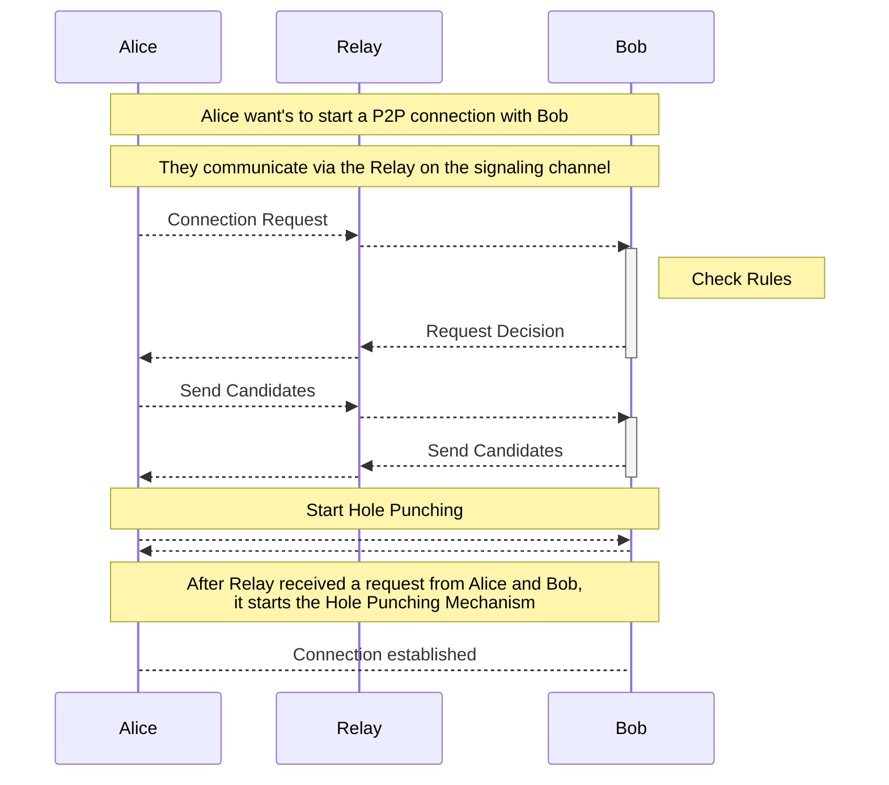

# Privacy-Aware Singaling before Hole Punching on Internet Overlay

## Situation

qaul has a built-in Internet overlay interconnection possibilities.

Most users are behind a firewall. Directly interconnecting with another user requires firewall hole punching, which requires a directly connectable node on the Internet to initiate.

Direct connections also reveal IP addresses to the other party. Depending on the user's situation and attack vector, the user can decide to which other users he wants to connect to. The following options will be available:

- A manually curated white-list of users to connect to.

- Allow connections to trusted users

- Allow connections to all users

All of these options are opt-in and configurable by the user. By default, no P2P connection is accepted.

## Protocol

