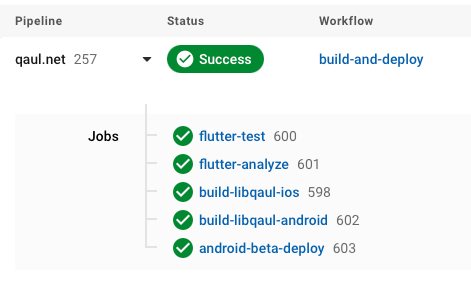

# CircleCI
Here's a breakdown of each task that can be currently performed by CircleCI, and how to trigger such task:

1. [Testing/analyzing Flutter codebase](#flutter-test-analyze)
2. [Building libqaul binaries](#build-libqaul-android-and-ios-binaries)
3. [Building and Releasing a new Mobile Version](#release-mobile-beta-version)

### flutter-test-analyze
This workflow is triggered on each commit pushed to the repo. It runs
`flutter test` and `flutter analyze` in the `./qaul_ui` folder.

### build-and-deploy
This workflow goes through the following steps:

1. Test/analyze the flutter codebase
1. Build the Android *.AAR files & iOS *.a files for libqaul
1. Build and release new beta builds for Android (Play Store) and iOS (Testflight)

One can either trigger the **entire workflow** or **only the Step 2**.

#### Build libqaul Android and iOS binaries
This task builds both library binaries and store them as artifacts on CircleCI, where you can download them.

To trigger such a task in isolation, one must create an annotated tag starting with the "rust_" prefix.

```bash
# Creates annotated tag
git tag -a rust_<brief descriptor of your branch> -m '<brief message>'

# Pushes both commits and annotated tags (available since Git 1.8.3)
git push --follow-tags
```

All pipelines can be seen on the [CircleCI app dashboard](https://app.circleci.com/pipelines/github/qaul/qaul.net?filter=all).
Search for your pushed tag and, once the pipeline succeeds, you can retrieve the binaries.

1. Click on either `build-libqaul-ios` or `build-libqaul-android` jobs:

   
1. Under the *Artifacts* tab you'll be able to download their respective binaries:


#### Release Mobile Beta Version
This task will create a beta release on the Play Store & Testflight, as well as generate the libqaul mobile binaries as artifacts.
To trigger this workflow, create an annotated tag prefixed by "v". You may use the version described in `qaul_ui/pubspec.yaml` as the release version.

```bash
# Creates annotated tag
git tag -a v<app version> -m '<brief message>'

# Pushes both commits and annotated tags (available since Git 1.8.3)
git push --follow-tags
```
